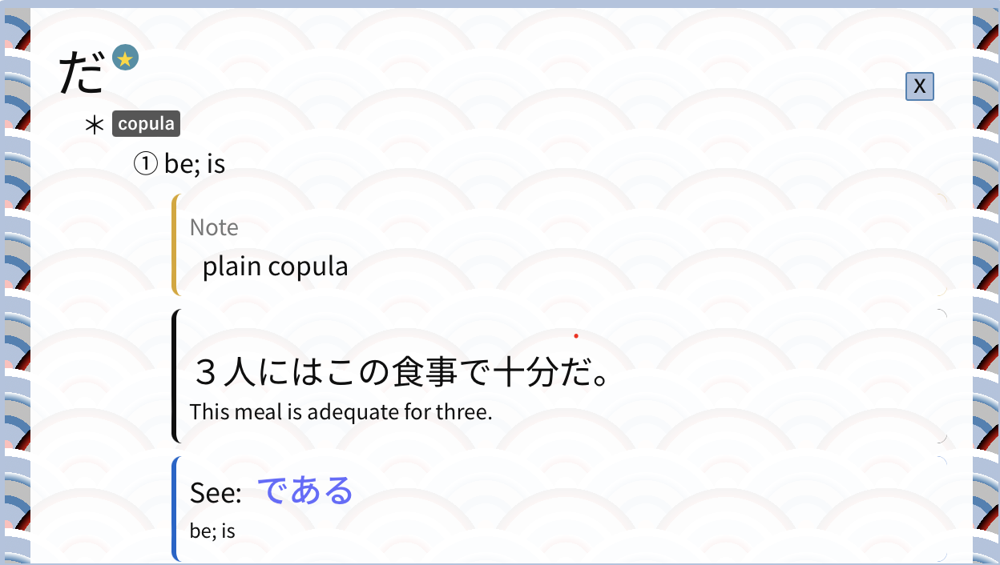
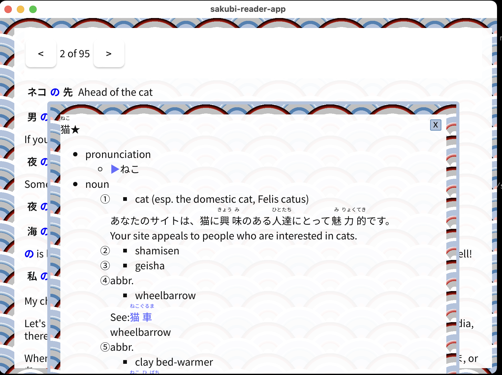

## sakubi-reader-app

A `native` [tauri](https://tauri.app/) application implementing colorization from [sakubi reader](https://github.com/kentaromiura/sakubireader),
include an embedded [jitendex](https://jitendex.org/) dictionary that can be enabled with shift,

Changelogs:
===
version 0.3.0

Using [rodio](https://github.com/RustAudio/rodio) and [magnum](https://github.com/seratonik/magnum-rs) to play sound in dictionary;
Fix other missing assets (svgs)
Implement a global lookup function

version 0.2.0
===
since this version the db is exported using https://github.com/kentaromiura/jitendex-analysis,
fixing a potential issue with an unknown license;
db is shrinked from 377 MB to 55M thanks to [zstandard](https://github.com/facebook/zstd);
a better db structure is used as well.

Multiple definitions now works in case same kanji have more than 1 meaning.
Links to other definitions inside a definitions also works now.

MiniYT class now allows dragging
MiniYT allows scrolling
MiniYT definitions has been styled using Jitendex style

TODO:
===

add a menu to make `lookup` easy to access it w/out devTools
maybe zoom button+animation for the MiniYT to show it 95vw/95vh

Screenshots:
===

older:

